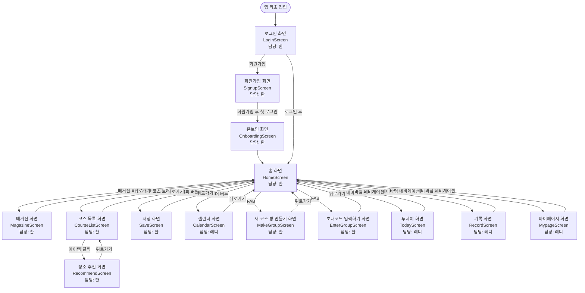

# 프로젝트 소개
DayToDo는 연인, 친구, 가족과 함께하는 소중한 하루를 더 쉽고 자연스럽게 계획하고 기록할 수 있도록 돕는 데이트 경험 관리 서비스입니다.
사용자는 원하는 분위기, 위치, 가격대에 맞는 장소를 추천받고, 코스 구성부터 이동 계획, 비용 관리, 하루의 기록까지 하나의 흐름 안에서 관리할 수 있습니다.
DayToDo는 단순한 일정 관리 앱을 넘어, 장소 선택과 비용 계산의 번거로움을 줄이고 사용자가 함께하는 순간에 더욱 집중할 수 있도록 돕는 것을 목표로 합니다.

# 팀원 소개

| 이름     | 역할                                                    |
|--------|-------------------------------------------------------|
| 환/이창환  | 로그인, 회원가입<br/>매거진<br/>홈<br/>저장<br/>코스 방 만들기<br/>장소 추천 |
| 레디/문하진 | 캘린더<br/>투데이<br/>일기<br/>마이페이지                          |

# 기술 스택
### 언어


### 아키텍처
MVVM + 멀티모듈

### 프레임워크


### 라이브러리


# 프로젝트 구조
```text
├── :app
├── :build-logic
│   └── :convention
├── :core
├── :uikit
├── :data
├── :domain
└── :feature
    ├── :auth
    ├── :home
    ├── :magazine
    ├── :course
    ├── :save
    ├── :calendar
    ├── :today
    ├── :record
    └── :mypage
```

# 플로우 정리
| 화면 이름         | 스크린 ID           | 진입 경로                         | 담당자 |
|---------------|------------------|-------------------------------|-----|
| 로그인 화면        | LoginScreen      | 앱 최초 진입                       | 환   |
| 온보딩 화면        | OnboardingScreen | 회원가입 후 첫 로그인 시                | 환   |
| 회원가입 화면       | SignupScreen     | 로그인 화면                        | 환   |
| 매거진 화면        | MagazineScreen   | 홈 화면에서 매거진 버튼 클릭 시            | 환   |
| 홈 화면          | HomeScreen       | 다른 화면에서 뒤로가기, 로그인 후, 바텀 네비게이션 | 환   |
| 코스 목록 화면      | CourseListScreen | 홈 화면에서 생성한 코스 보러가기 클릭 시       | 환   |
| 저장 화면         | SaveScreen       | 홈 화면에서 책갈피 버튼 클릭 시            | 환   |
| 캘린더 화면        | CalendarScreen   | 홈 화면에서 캘린더 버튼 클릭 시            | 레디  |
| 새 코스 방 만들기 화면 | MakeGroupScreen  | 홈 화면 FAB                      | 환 |
| 초대코드 입력하기 화면  | EnterGroupScreen | 홈 화면 FAB                      | 환 |
| 장소 추천 화면      | RecommendScreen  | 코스 목록 화면에서 아이템 클릭 시           | 환 |
| 투데이 화면        | TodayScreen      | 바텀 네비게이션 | 레디 |
| 기록 화면         | RecordScreen     | 바텀 네비게이션 | 레디 |
| 마이페이지 화면      | MypageScreen     | 바텀 네비게이션 | 레디 |



# 빌드 및 실행 방법
1. 프로젝트 클론
```bash
   git clone https://github.com/DayTodo/DayTodo_FE.git
   cd DayTodo_FE
```

2. Android Studio로 프로젝트 열기

Android Studio에서 프로젝트 루트 폴더를 열고 Gradle Sync를 진행합니다.

3. 실행 환경 확인

프로젝트 실행 전 아래 환경을 확인합니다.

- JDK 17 이상 설정
- Android SDK Platform 36 설치
- 실행할 에뮬레이터 또는 Android 기기 연결

4. 로컬 설정 파일 확인

프로젝트 실행에 필요한 로컬 설정값이 있는 경우, 프로젝트 루트에 `local.properties` 파일을 생성합니다.

API Base URL, API Key 등 민감한 설정값이 필요한 경우에는 팀 내부에서 공유된 값을 사용합니다.

5. 앱 실행

Android Studio 상단의 실행 버튼을 눌러 앱을 실행하거나 터미널에서 아래 명령어로 빌드할 수 있습니다.

- Windows 환경:
```bash
  gradlew.bat build
```

- macOS 환경:
```bash
    ./gradlew build
```

---
Git 컨벤션은 [위키](https://github.com/DayTodo/DayTodo_FE/wiki/Convention) 참고
